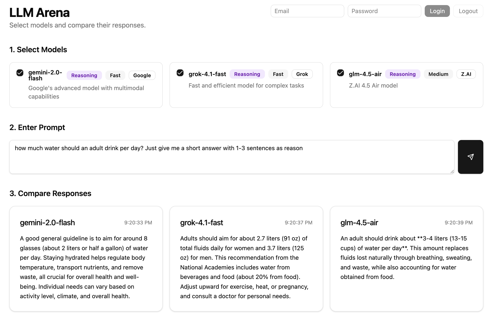

# Competing LLM 

**Disclaimer**: This project is still in development.

This is a project for building an LLM chat application that pushes multiple LLMs competing with each other to provide the best responses to user queries.

## Features

Backend is implemented via FastAPI to handle LLM calls.
Frontend is implemented via React, Vite, Tailwind CSS.

Both are deployed on Vercel:

- [Backend](https://competing-llm-arena.vercel.app)
- [Frontend](https://competing-llm.vercel.app)

TODO:
- [ ] Implement Agentic logic for competition
- [ ] Prompt engineering for competition
